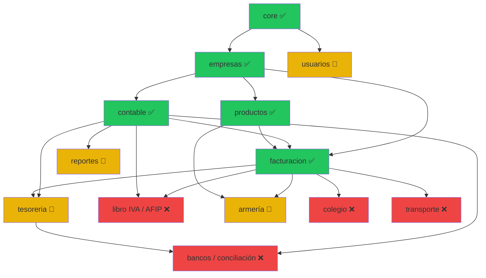

# ERP IKIGAI — Guía Modular

> **Dueño:** Gemini (IA de diseño modular)
> **Versión:** 1.0 — 2026-06-04
> **Propósito:** Índice vivo de todos los módulos, su estado, dependencias y orden de implementación.
> **Cuándo se lee:** Antes de diseñar o planificar cualquier módulo.
> **Complementa:** `Documento_integral_ERP_Ikigai_v0_GPT.md` (visión global de Opus).

---

## 1. Stack Técnico (referencia rápida)

| Capa | Tecnología |
|------|-----------|
| Backend | Python 3.10+, Django 6.0.4, PostgreSQL 14+ |
| Frontend | Tailwind CSS + HTMX 1.27 + Alpine.js |
| ORM | Django ORM con `transaction.atomic()` + `select_for_update()` |
| Tests | `python manage.py test` (runner nativo) |
| UI | Interfaz propia (NO Django Admin). Modales HTMX, parciales async |

---

## 2. Convenciones de Código

| Regla | Ejemplo |
|-------|---------|
| PK explícita por modelo | `compras_id`, `ventas_id`, `codigo_id` |
| `db_table` explícito si colisión | `cble_cuentas`, `cble_asiento_enc` |
| Texto en mayúsculas en `save()` | razón social, productos, conceptos (excepto correo, enums) |
| Servicios en `<app>/services/` | `contable/services/asientos.py` |
| Signals en `<app>/signals.py` | Registrados en `<app>/apps.py` → `ready()` |
| Tests en `<app>/tests/` | Mínimo: caso feliz + 1 edge case |
| Migraciones nombradas | `python manage.py makemigrations <app> --name <desc>` |
| Idioma | Todo en español (código, comentarios, docs) |

---

## 3. Índice de Módulos y Estado

### Módulos Core (infraestructura)

| # | Módulo | App Django | Estado | Plan | Dependencias |
|---|--------|-----------|--------|------|-------------|
| 01 | Core / Auditoría | `core` | ✅ Completo | — | — |
| 02 | Empresas / Sucursales / Ejercicios | `empresas` | ✅ Completo | — | — |
| 03 | Usuarios / Permisos | `usuarios` | 🔶 Parcial | [006_permisos_modulares.md](planes/006_permisos_modulares.md) | — |

### Módulos Operativos (núcleo del ERP)

| # | Módulo | App Django | Estado | Plan | Dependencias |
|---|--------|-----------|--------|------|-------------|
| 04 | Contabilidad (asientos, saldos, contabilización) | `contable` | ✅ Completo | [001_automatizacion_contable.md](planes/001_automatizacion_contable.md) ✅ | empresas, facturacion |
| 05 | Facturación (compras, ventas, items) | `facturacion` | ✅ Completo | [004_vistas_facturacion_htmx.md](planes/004_vistas_facturacion_htmx.md) ✅ | empresas, contable, productos |
| 05.b | Abastecimiento: Órdenes de Compra, Recepción y Circuito Interno | `facturacion` + `core` (numerador) | ✅ Completo | [028_ordenes_compra_recepcion.md](planes/028_ordenes_compra_recepcion.md) ✅ | facturacion, productos, empresas |
| 06 | Productos / Stock | `productos` | ✅ Completo | [002_automatizacion_stock_totales.md](planes/002_automatizacion_stock_totales.md) ✅ | empresas |
| 07 | Tesorería (recibos, OP, valores, medios de pago) | `tesoreria` | 🔶 En Progreso | [005_tesoreria_medios_pago.md](planes/005_tesoreria_medios_pago.md) | contable, facturacion |
| 08 | Libro IVA / AFIP / CAE | `facturacion` (sub) | ❌ Pendiente | [007_libro_iva_afip.md](planes/007_libro_iva_afip.md) | facturacion, contable |
| 09 | Bancos / Conciliación | `contable` o `tesoreria` | ❌ Pendiente | [008_bancos_conciliacion.md](planes/008_bancos_conciliacion.md) | contable, tesoreria |
| 10 | Reportes contables y gerenciales | `contable` (sub) | ✅ Completo | [009_reportes_contables.md](planes/009_reportes_contables.md) | contable |

### Verticales de Negocio

| # | Módulo | App Django | Estado | Plan | Prioridad |
|---|--------|-----------|--------|------|-----------|
| 11 | Armería | `facturacion` (extensiones) | 🔶 Parcial (modelos) | [010_vertical_armeria.md](planes/010_vertical_armeria.md) | Alta (diseño avanzado) |
| 12 | Colegio | futuro: `colegio` | ❌ Pendiente | [011_vertical_colegio.md](planes/011_vertical_colegio.md) | Media-Alta |
| 13 | Transporte | futuro: `transporte` | ❌ Pendiente | [012_vertical_transporte.md](planes/012_vertical_transporte.md) | Media-Alta |
| 14 | GNC / Combustibles | futuro: `gnc` | ❌ Pendiente | — | Media |
| 15 | Inmobiliaria | futuro: `inmobiliaria` | ❌ Pendiente | — | Media |
| 16 | Peluquería | futuro: `peluqueria` | ❌ Pendiente | — | Baja |
| 17 | Agropecuario y Acopio de Tabaco | `verticalidades/agricola` (`core_agricola`, `tabaco`, `granos`) | 🔶 Etapas 0 a 5 completas (maestros + romaneo + liquidación + pago + stock + lotes/acondicionamiento/venta/margen) — sigue Etapa 6 (Reportes FET y libro de retenciones) | [plan integral](agricola/plan%20inicial%20agricola.md) · [078](planes/078_arquitectura_verticalidad_agricola.md) · [080](planes/080_terminos_enchufables_saldos_stock.md) ✅ · [081](planes/081_agricola_etapa0_maestros_tabaco.md) ✅ · [082](planes/082_agricola_etapa1_romaneo.md) ✅ · [083](planes/083_agricola_etapa2_liquidacion.md) ✅ · [084](planes/084_agricola_etapa3_pago.md) ✅ · [085](planes/085_agricola_etapa4_stock.md) ✅ · [086](planes/086_agricola_etapa5_lotes_acondicionamiento_venta.md) ✅ | Alta |

### Infraestructura y Operaciones

| # | Módulo | Estado | Plan | Cuándo |
|---|--------|--------|------|--------|
| 17 | Migración datos VFP | ❌ Pendiente | [013_migracion_vfp.md](planes/013_migracion_vfp.md) | Antes de go-live |
| 18 | Seguridad / Deploy | ❌ Pendiente | [014_seguridad_deploy.md](planes/014_seguridad_deploy.md) | Antes de go-live |

---

## 4. Grafo de Dependencias



---

## 5. Orden de Implementación Sugerido

> Este orden respeta dependencias técnicas y prioridad de negocio.

| Orden | Módulo | Razón |
|-------|--------|-------|
| 1 | Reportes contables | ✅ Completo |
| 2 | Bancos y conciliación | Siguiente paso lógico del Core. Alto valor comercial. (Requiere Tesorería) |
| 3 | Libro IVA + AFIP CAE | Facturación electrónica y libros obligatorios |
| 4 | Verticales (armería/colegio/transporte) | Va antes de permisos para contemplar sus particularidades |
| 5 | Permisos modulares | Va al final del desarrollo para que contemple todo lo nuevo creado |
| 6 | Migración VFP + Seguridad | Se hará una vez que el proyecto esté 100% finalizado |
| Delegado | Tesorería (completar) | Asignado a otro desarrollador externo |

---

## 6. Estructura de un Plan de Módulo

Cada archivo en `docs/planes/` debe seguir esta estructura para que Codex pueda implementar directamente:

```markdown
# Plan XXX — [Nombre del Módulo]

## Estado: ✅ Completado | 🔶 En Progreso | ❌ Pendiente

## Objetivo
(2-3 líneas describiendo qué resuelve este módulo)

## Modelos
| Modelo | App | Campos clave | Notas |
|--------|-----|-------------|-------|

## Servicios
| Servicio | Archivo | Firma | Qué hace |
|----------|---------|-------|----------|

## Archivos a Crear/Modificar
- `app/models.py` — agregar ModeloX
- `app/services/nombre.py` — nuevo servicio
- `app/signals.py` — signal post_save
- `app/tests/test_nombre.py` — tests

## Tests Mínimos
| Test | Qué verifica |
|------|-------------|

## Dependencias
- Requiere: [módulos que deben estar listos]

## Referencia VFP
- DBFs: `nombre.dbf` (qué contiene)
- PRGs: `nombre.prg` (qué hace)

## Criterio de Hecho
- [ ] Checklist verificable
```

---

## 7. Cómo Usar Esta Guía

### Si sos Gemini (el Patrón):
1. Leé esta guía para entender el estado general
2. Seleccioná el módulo que toca implementar
3. Si tiene plan en `docs/planes/`, leelo y actualizalo
4. Si no tiene plan, creá uno siguiendo la estructura de §6
5. Actualizá la tabla de §3 con el nuevo estado

### Si sos Codex (el Operario):
1. Leé el plan específico del módulo que te piden (`docs/planes/XXX.md`)
2. Leé los archivos `.py` que indica el plan
3. Implementá siguiendo el plan
4. Actualizá `docs/walkthrough.txt` con lo que hiciste

### Si sos Opus (el Jefe):
1. No necesitás leer esta guía en detalle
2. Tu documento es `Documento_integral_ERP_Ikigai_v0_GPT.md`
3. Actualizá la sección "Estado Actual" del integral cuando Gemini te reporte progreso
