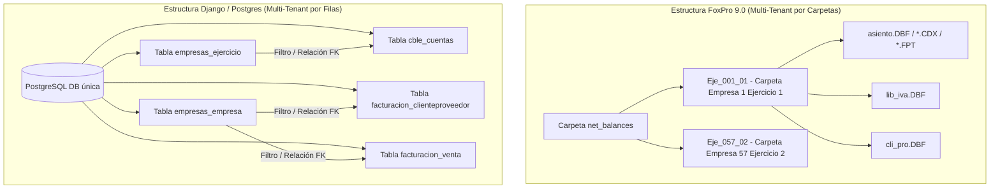

# Análisis Comparativo y Súper Prompt de Desarrollo — ERP Ikigai

Este documento presenta el análisis técnico del sistema contable y ERP heredado desarrollado en **Visual FoxPro 9.0 (VFP)** y su correspondencia con el nuevo sistema **Django / PostgreSQL (ERP Ikigai)** en `d:\jm_soft\erp-ikigai`. Al final, se incluye el **Súper Prompt** diseñado para continuar con el desarrollo de forma estructurada.

---

## 1. Arquitectura del Sistema: VFP 9.0 vs Django / PostgreSQL

La transición del sistema original a la web moderna implica un cambio fundamental en el diseño de los datos y su almacenamiento:



### Tabla de Correspondencia Técnica General

| Aspecto | Sistema Anterior (VFP 9.0) | Nuevo Sistema (Django/Postgres - erp-ikigai) |
| :--- | :--- | :--- |
| **Almacenamiento** | Tablas DBF, archivos de índices CDX y campos memo FPT distribuidos. | Base de datos relacional PostgreSQL con almacenamiento centralizado. |
| **Multi-Empresa** | Físico: Carpetas de red separadas (ej. `Eje_057_01`, `Eje_083_03`). | Lógico: Campo Foreign Key `empresa_id` y `ejercicio_id` en las tablas operativas. |
| **Ejercicios Fiscales** | Definidos a nivel de carpetas y base central `principal!ejercicios`. | Modelo `Ejercicio` (`empresas_ejercicio`) con validación de no solapamiento. |
| **Vistas e Índices** | Definidos en código PRG (ej. `genera_vista_contable.prg`) usando vistas SQL VFP. | Índices compuestos en Django (ej. `[empresa_id, fecha]`) optimizados para Postgres. |
| **Motor de Consulta** | Motor local de FoxPro (comando `SELECT` local y búferes locales). | QuerySet ORM de Django ejecutado en servidor Postgres, HTMX en frontend. |

---

## 2. Mapeo de Modelos Contables y de Facturación

Basado en el análisis de `genera_vista_contable.prg` de VFP 9.0 y los modelos actuales de Django en `facturacion/models.py` y `contable/models.py`:

### 2.1. Entidades de Cuentas y Asientos
* **Cuentas (`contable!cuentas` $\rightarrow$ `cble_cuentas`)**:
  * VFP usa `codigo`, `detalle`, `tipo` (Activo, Pasivo, etc.).
  * Django utiliza el modelo [Cuenta](file:///d:/jm_soft/erp-ikigai/contable/models.py#L6-L39) (`db_table = "cble_cuentas"`) con campos como `jerarquia`, `cuenta` (nombre), e `imputable` (0: No, 1: Sí).
* **Asientos y Movimientos (`contable!asto_enc` / `asto_mov` $\rightarrow$ `cble_asiento_enc` / `cble_asiento_mov`)**:
  * En VFP, `asto_enc` tiene `id_asto`, `asiento`, `fecha`, `concepto`, `monto` y `id_eje_a`.
  * En Django, se mapea para mantener la partida doble (Debe y Haber), relacionándolo con la cuenta contable de forma imputable.

### 2.2. IVA y Comprobantes (`contable!lib_iva` $\rightarrow$ `facturacion_libiva`)
* El registro de IVA en VFP (`lib_iva`) centraliza compras y ventas diferenciadas por el flag `c_v` ('C' o 'V'). Contiene el detalle impositivo completo: `neto`, `alic_iva`, `iva`, tasas específicas (`itc`, `imp_int`), retenciones/percepciones (`ret_iva`, `ret_gcia`, `ret_ib`, `ret_mun`, `sircreb`), y datos de CAE (`cae`, `vto_cae`, `cod_qr`).
* En Django, las compras y ventas se registran de forma separada en `Compra` / `CompraItem` y `Venta` / `VentaItem`, alimentando mediante signals el modelo de trazabilidad `Movimiento` (tabla `facturacion_movimiento`) y el futuro reporte de Libro IVA Digital.

---

## 3. Mapeo de Módulos de Negocio (Verticales)

El sistema original en VFP 9.0 maneja múltiples rubros para sus clientes. Se han analizado las vistas de cada sector y su diseño correspondiente en Django:

### 3.1. Armería (Weapons/Ammo)
* **Contexto VFP**: Tablas y pantallas de inventario de armas (`inventario_armas.scx`).
* **Diseño Django**:
  * **Clientes**: [ExtensionArmeria](file:///d:/jm_soft/erp-ikigai/facturacion/models.py#L123-L130) almacena la CLU (Credencial de Legítimo Usuario) y su fecha de vencimiento (`clu_vto`).
  * **Productos Individuales**: El modelo [Subproducto](file:///d:/jm_soft/erp-ikigai/productos/models.py#L135-L178) maneja ítems únicos por número de `serie` y número de `cuim` (otorgado por ANMaC/ARCA) con trazabilidad de su costo de adquisición y cotización de venta.
  * **Venta**: [VentaItem](file:///d:/jm_soft/erp-ikigai/facturacion/models.py#L267-L282) incluye campos específicos como `credencial` y `dmp` (Declaración de Municiones).

### 3.2. Transporte (Freight/Logistics)
* **Contexto VFP**: Archivos `genera_vista_transporte.prg` y `genera_vista_expresorivadavia.prg`. Consultas de `cons_orden_carga` y `repartos`.
* **Diseño Django**: Requerirá la creación de los modelos `OrdenCarga`, `Reparto`, y `LiquidacionChofer`. Estos vincularán el comprobante (Factura o Remito) con la hoja de ruta y calcularán los fletes pendientes a pagar a los fleteros contratados o choferes propios.

### 3.3. Colegio (IPJA - Instituto Privado Joven Argentino)
* **Contexto VFP**: `genera_vista_colegio.prg`. CUIT exento `30638118382`.
* **Diseño Django**:
  * **Clientes**: El modelo [ExtensionJosen](file:///d:/jm_soft/erp-ikigai/facturacion/models.py#L131-L138) define un `coeficiente` de descuento o recargo y lo asocia a un [RubroJosen](file:///d:/jm_soft/erp-ikigai/facturacion/models.py#L32-L41).
  * **Cobros**: Lógica para facturación masiva de cuotas escolares mensuales con coeficientes variables por alumno.

### 3.4. Estaciones de Servicio (GNC/Combustibles)
* **Contexto VFP**: Tablas `gnc_tot_diario.dbf`, `gnc_diario.dbf`, `gnc_n.dbf`, y proceso `gnc_captura.prg`.
* **Diseño Django**: Requerirá modelos para controlar la planilla diaria de playa: lectura inicial y final de surtidores, cálculo de faltantes (`gnc_cons_faltante`), ventas en efectivo/tarjetas, y conciliación contra el inventario del tanque de combustible.

### 3.5. Inmobiliaria (Real Estate)
* **Contexto VFP**: `genera_vista_inmobiliaria.prg` e `inm_aux_vta.dbf`.
* **Diseño Django**: Modelos para contratos de alquiler con indexación, control de vencimientos, cobro de alquileres a inquilinos y posterior liquidación a propietarios aplicando comisiones de administración.

### 3.6. Peluquería (Hair Salon)
* **Contexto VFP**: `genera_vista_peluqueria.prg` y `pelu_cobro_tarjetas_aux.dbf`.
* **Diseño Django**: Gestión de órdenes de trabajo diarias, turnos asignados a estilistas, cálculo de comisiones a los profesionales del salón y conciliación de cobros con tarjetas de crédito/débito.

---

## 4. Reglas Críticas de Arquitectura en Django (Establecidas)

Para evitar duplicaciones y fugas de datos que ocurrían en el sistema VFP original, se establecen las siguientes directrices técnicas:

1. **Atomicidad Transaccional**: El cálculo de saldos (`ClienteProveedor.saldo`) y el stock de los productos (`StockSucursal.cantidad`) debe ser atómico. Cualquier creación/modificación de ítems de compra/venta se encapsulará en `transaction.atomic()` a través de un único servicio centralizado.
2. **Cálculo de Totales en el Modelo**: Las cabeceras de compras y ventas no deben calcularse en los formularios. El método `recalcular_totales()` del modelo debe sumar neto, alícuotas de IVA y percepciones a partir de los items guardados, gatillado por signals de Django.
3. **Rol de `Movimiento`**: El modelo `Movimiento` se asume como una **vista materializada** de lectura rápida para reportes impositivos e históricos. Se actualiza mediante signals `post_save`/`post_delete` de los comprobantes y no admite modificaciones directas del usuario.
4. **Validaciones en el Modelo**: Las validaciones complejas (como no solapamiento de fechas en ejercicios fiscales y clasificaciones correctas de clientes/proveedores) se realizan en el método `clean()` del modelo, garantizando su validez en cualquier flujo (admin, HTMX, shell o scripts de migración).

---

## 5. EL SÚPER PROMPT

Copia y pega este prompt en el chat del asistente para guiar el desarrollo de cualquier nuevo módulo del ERP en Django.

```markdown
Actúa como un arquitecto y programador senior experto en Python, Django, PostgreSQL y HTMX. 
Estamos desarrollando un ERP modular multi-empresa llamado "ERP Ikigai" (localizado en d:\jm_soft\erp-ikigai), el cual migra y unifica la lógica de un sistema heredado desarrollado en Visual FoxPro 9.0 (cuyos datos históricos están en d:\jm_soft\net_balances).

Debes seguir estrictamente las siguientes pautas de diseño y desarrollo en cada propuesta de código:

### 1. STACK TECNOLÓGICO Y DISEÑO
- Backend: Python 3.x, Django 5.x, PostgreSQL.
- Frontend: HTML Semántico, CSS Vanilla limpio con estética premium (gradientes modernos, modo oscuro/claro elegante, micro-animaciones en botones y transiciones suaves), y HTMX para interacciones dinámicas y modales asíncronos.
- Evita placeholders o código simulado. Todo el código propuesto debe ser 100% funcional.
- Mantén la integridad del código: conserva comentarios, docstrings y lógica previa no relacionada al cambio. Comenta en detalle la lógica detrás de tus modificaciones en Español.

### 2. ESTRUCTURA DE BASE DE DATOS Y MULTI-TENANCY (Logical vs Physical)
- El sistema heredado en VFP usaba multi-tenant físico (carpetas separadas como Eje_057_01 para cada empresa y año).
- ERP Ikigai usa multi-tenant lógico por filas en una base de datos PostgreSQL única.
- Todas las tablas principales (Compras, Ventas, Cuentas, etc.) se vinculan a la empresa mediante ForeignKey a `empresas.Empresa` y al año fiscal activo mediante ForeignKey a `empresas.Ejercicio`.
- Las búsquedas e informes siempre deben filtrar primero por la empresa activa y por el ejercicio activo para garantizar el rendimiento.

### 3. REGLAS CRÍTICAS DE TRANSACCIONALIDAD E INTEGRIDAD
- **Atomicidad de Saldos**: Los saldos de clientes y proveedores se calculan en un servicio centralizado ('contable/services/saldos.py') usando transaction.atomic(). No se asigna saldo directamente en las vistas.
- **Cálculo de Stock**: El stock de productos se actualiza exclusivamente mediante signals (post_save/post_delete) sobre items de comprobante, calculando los deltas con pre_save para evitar duplicaciones.
- **Totales de Cabecera**: El neto, IVA y total general de facturas/compras se calculan en métodos del modelo ('recalcular_totales()') invocados desde los items, no en formularios HTML.
- **El Modelo Movimiento**: 'Movimiento' actúa como una vista materializada automatizada (Kardex de auditoría) sincronizada por signals de compras y ventas.

### 4. MÓDULOS DE NEGOCIO VERTICALES A SOPORTAR
Al diseñar nuevos flujos o campos, ten en cuenta la especialización del cliente según su CUIT:
- **Armería (Weapons)**: Control de CLU y vencimiento en 'ExtensionArmeria'. Trazabilidad física de unidades individuales mediante el modelo 'Subproducto' (serie, CUIM, estado nuevo/usado, propiedad propia/consignada). Facturación con campos credencial y DMP en 'VentaItem'.
- **Transporte (Freight)**: Gestión de fletes, hojas de ruta (Repartos), liquidación a choferes y órdenes de carga.
- **Colegio (Education)**: Coeficientes de descuento/recargo para alumnos en 'ExtensionJosen' y facturación masiva.
- **GNC (Gas Stations)**: Cierre de turnos de surtidores, planilla de playa y auditoría de faltantes de combustible.
- **Inmobiliaria (Real Estate)**: Contratos de alquiler, indexación mensual de montos, cobros y comisiones.
- **Peluquería (Salon)**: Turnos de estilistas, comisiones por servicio y conciliación de liquidaciones de tarjetas.

### TAREA ACTUAL
[INSERTAR AQUÍ LA TAREA ESPECÍFICA A REALIZAR, POR EJEMPLO: "Implementar el módulo de Recibos de Cobro y Órdenes de Pago vinculados a facturas, asegurando actualizar los saldos a través del servicio de saldos atómico."]

Por favor, analiza el código actual de la aplicación antes de proponer cambios, respetando la nomenclatura existente de variables, bases de datos y la codificación anterior para permitir un rollback limpio si es necesario. Responde siempre en Español.
```

---

## 6. Siguientes Pasos Recomendados

Para continuar con el desarrollo de forma sólida, se aconseja:
1. **Implementar las Mejoras de Prioridad 1 y 2**: Completar el servicio centralizado de saldos atómicos y añadir los tests automatizados para asegurar la base transaccional antes de agregar nuevos módulos.
2. **Crear Scripts de Migración Seguros**: Utilizar la biblioteca `dbfread` de Python para extraer datos históricos de las carpetas `Eje_XXX` de VFP y subirlos a la base PostgreSQL de Django de forma automatizada por lotes.
3. **Consolidar los Módulos Verticales**: Diseñar las vistas y formularios HTMX para Armería (Subproductos por número de serie) y Colegio (coeficientes automatizados), que son los módulos prioritarios en la configuración actual.
