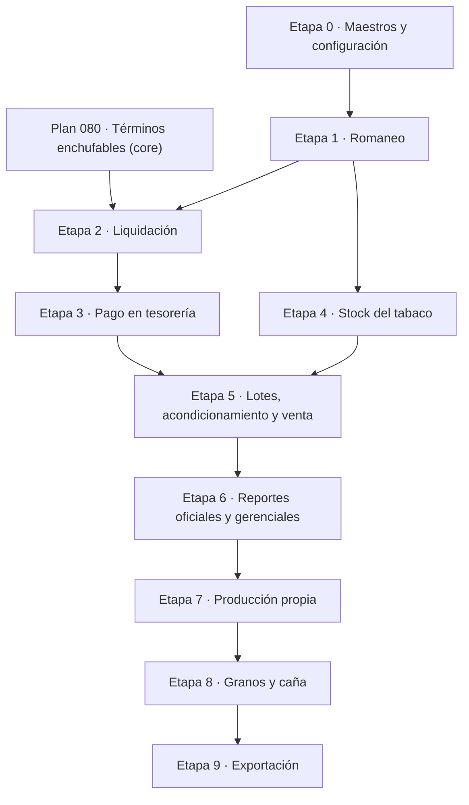

# Plan de Implementación — Verticalidad Agrícola (ERP Ikigai)

**Versión:** 1.0 · **Fecha:** 2026-09-06 · **Estado:** diseño aprobado, pendiente de ejecución

Este documento define la arquitectura, las fórmulas de cálculo, el modelo de datos y el plan
por etapas de la verticalidad **Agrícola** de ERP Ikigai, con foco inicial en el **acopio y
comercialización de tabaco**.

Reemplaza a la versión anterior del documento y a la traducción directa del paquete de diseño
externo `erp_agro_diseno_v0_1`, cuyas hipótesis sobre el ERP fueron verificadas contra el código
y corregidas donde correspondía (ver §10).

---

## 1. Principios rectores

1. **Ampliación, no ERP paralelo.** La verticalidad no crea maestros, cuentas corrientes,
   stock ni contabilidad propios. Reutiliza los del core.
2. **Encapsulamiento en `verticalidades/agricola/`** (`core_agricola`, `tabaco`, `granos`),
   bajo la arquitectura *Modo Enchufe* del [Plan 075](../planes/075_arquitectura_modo_enchufe.md).
3. **Prefijo obligatorio `agricola_`** en todos los `db_table`
   ([Plan 078](../planes/078_arquitectura_verticalidad_agricola.md)).
4. **Prueba de fuego.** Si se borra `verticalidades/agricola/`, el ERP debe seguir arrancando y
   operando. Ningún servicio del core puede importar la verticalidad sin `try/except ImportError`.
5. **Contabilidad unificada.** Los asientos se generan **exclusivamente** con
   `contable.services.asientos.crear_asiento()`. Nunca se insertan `AsientoLinea` a mano. Los
   saldos se recalculan sólo por `contable.services.saldos`.
6. **`condic`.** Todo comprobante y todo asiento de la verticalidad lleva `condic`, con
   **default 1 (Real/Fiscal)**, nunca hardcodeado. El asiento hereda el `condic` del comprobante.
   Todo listado con importes ofrece el filtro Real / Presupuestado / Ajuste / Auditoría.
7. **Multiempresa y auditoría.** Modelos sobre `core.AuditModel`, querysets filtrados por la
   empresa activa del middleware, operaciones críticas en `AuditLog`.
8. **UI.** HTML + Tailwind + HTMX. **Sin Django Admin.** Todo selector de entidad usa el patrón
   obligatorio **Typeahead + Lupa**. Todo importe usa el formato es-AR centralizado:
   clase `.fInputAR` en inputs y filtro `{{ valor|formato_ar }}` en displays.
9. **Interruptor.** La verticalidad se activa por empresa con
   `EmpresaVertical.hace_tabaco` / `hace_granos` (`empresa.tipo_actividad == 'AGRICOLA'`).

---

## 2. El circuito: dos actos separados

> **Regla de negocio central.** La liquidación y el pago son **dos hechos distintos**.
> Se liquida la compra al productor (nace la deuda) y **después**, en tesorería, se emite la
> Orden de Pago que la cancela.

```
ROMANEO                    LIQUIDACIÓN                    PAGO
(físico + clasificación)   (comprobante fiscal)           (tesorería)
─────────────────────      ─────────────────────          ─────────────────────
recepción de fardos   →    comprobante 150/151       →    Orden de Pago
pesaje                     asiento de compra              aplicación a la liquidación
clase por fardo            Libro IVA + alícuotas          retención de Ganancias
precio por coeficiente     retenciones de liquidación     medios de pago
                           deuda en cuenta corriente      cancelación del saldo
sin efecto contable        sin salida de fondos           salida de fondos
```

El sistema VFP anterior (`op_romaneo.scx`) resolvía liquidación y pago **en un solo acto**,
porque aquel cliente no tenía estructura administrativa y operaba solo. **Esa práctica no se
replica.** De los formularios VFP se toma únicamente la **lógica de cálculo**, que sí está
validada por años de uso (ver §3).

---

## 3. Fórmulas de cálculo

Extraídas de `op_romaneo.sct` y `compra_tabaco.sct`, y **validadas contra 132 registros reales**
de `cpra_clase_fec.DBF` (marzo 2024, variedad Burley, ponderante 2.500).

### 3.1 Precio por clase

```
precio_unitario = REDONDEO(precio_ponderante_variedad × coeficiente_clase, 2)
importe_linea   = REDONDEO(precio_unitario × kilos, 2)
```

> Verificación: **132/132 filas** cumplen ambas fórmulas exactamente.

- El **precio ponderante** es por **variedad y campaña** (en VFP vivía en `tab_variedad.precio`;
  acá se versiona en `agricola_tabaco_lista_precio`).
- El **coeficiente** es el `porciento` de la clase (0,10 a 1,05).
- La clase `B1F` vale **1,00** en ambas variedades: es la clase índice. `H1F` vale **1,05**, o sea
  que el ponderante **no es un techo**.

### 3.2 Totales y estadística del romaneo

```
total_kilos    = Σ kilos de las líneas
total_importe  = Σ importe de las líneas
total_fardos   = cantidad de líneas
PPP            = REDONDEO(total_importe / total_kilos, 2)     (precio promedio ponderado)
% s/ponderante = PPP × 100 / precio_ponderante
```

Además, por **grupo de clase** (primera letra: B, C, N, T, X, H): kilos, cantidad de fardos y
porcentaje de participación sobre el total de kilos.

> El VFP sólo agrupaba B, C, N, T y X: **dejaba fuera el grupo H** de Virginia (H1F/H2F/H3F).
> El ERP debe derivar los grupos del maestro de clases, no de una lista fija.

### 3.3 IVA y letra del comprobante

```
SI productor.condicion_iva == 'RESPONSABLE INSCRIPTO':
        iva   = REDONDEO(neto × alicuota_vigente, 2)      → letra A · código ARCA 150
SI NO:
        iva   = 0                                          → letra B · código ARCA 151
```

Cada letra lleva **su propia numeración correlativa** (en VFP, `maestro_id.lcta` y
`maestro_id.lctb`). El punto de venta es un parámetro de la configuración del acopio.

### 3.4 Retenciones

Alícuotas **vigentes en el sistema VFP**. En Ikigai **no se hardcodean**: viven en el maestro
`agricola_tabaco_tipo_retencion` con vigencia temporal, y la liquidación **congela** la versión
aplicada.

| Concepto | Base de cálculo | Alícuota | Se aplica a | Momento |
|---|---|---|---|---|
| **Retención IVA** | el IVA de la liquidación | 50 % | sólo Responsable Inscripto | Liquidación |
| **EEAOC** | neto | 0,5 % | todos | Liquidación |
| **Uso de Agua** | neto | 0,3 % | todos | Liquidación |
| **Salud Pública** | neto | 1,0 % | todos | Liquidación |
| **Retención Ganancias** | acumulado mensual − MNI | 2 % | sólo Responsable Inscripto | **Pago** |

> Las cinco son **porcentuales sobre importe**. Ninguna se calcula por kilo. Queda descartada la
> hipótesis de bases por unidad física.

> **Momento — decidido (DA-01).** La columna *Momento* de la tabla es la asignación aprobada:
> las cuatro primeras se practican al liquidar y Ganancias al pagar. No está cableada en el
> código: es el campo `momento` del maestro, para que un cambio de criterio fiscal sea un cambio
> de dato. Ganancias **debe** ir en el pago, porque su base es el acumulado mensual de lo pagado.

**Retención de Ganancias — régimen acumulativo mensual:**

```
base_acumulada = neto_de_esta_liquidación + Σ netos ya liquidados al productor en el mes
SI base_acumulada > MNI:
        retención_total_del_mes = REDONDEO((base_acumulada − MNI) × 0,02 , 2)
        a_retener               = retención_total_del_mes − retenido_previamente_en_el_mes
SI NO:
        a_retener = 0
```

Valores VFP a la fecha del código: **régimen 78**, **MNI 224.000**, **alícuota 2 %**.
Deben quedar parametrizados y versionados, nunca en el código.

Esto exige un **acumulador mensual por productor** (en VFP, la vista `liq_mes_ret_gcia`) que
registre, por período y productor: importes liquidados y retenciones ya practicadas.

### 3.5 Importes de cierre

```
retenciones_liquidacion = ret_iva + eeaoc + uso_agua + salud_publica
total_liquidacion       = neto + iva − retenciones_liquidacion      ← deuda con el productor
neto_a_pagar            = total_liquidacion − ret_ganancias         ← informativo en el comprobante
```

`total_liquidacion` es el importe que:
- se acredita al productor en el asiento de la liquidación;
- alimenta el término nuevo de la cuenta corriente (§5.3);
- se cancela con la Orden de Pago.

La Orden de Pago paga `neto_a_pagar` en medios de pago reales **más** `ret_ganancias` como medio
de pago de categoría `RET`, de modo que `OrdenPago.total == total_liquidacion` y el saldo cierra
en cero. Ver §5.4.

### 3.6 Identificación y autorización del comprobante

La liquidación es un **comprobante de compra que emitimos nosotros** y que alimenta el Libro IVA
**Compras**. El sistema soporta **dos modos de autorización**, conviviendo, elegidos por el campo
`origen_autorizacion` de la liquidación:

#### Modo `MANUAL` — se implementa desde la Etapa 2

Para comprobantes de **talonario impreso con CAI** o emitidos desde el **comprobante en línea de
ARCA**. El operador **captura a mano**:

| Dato | Comportamiento |
|---|---|
| Tipo (`codiva`) | Se **propone** 150 o 151 según `condicion_iva` del productor. Editable, porque manda el papel. Al confirmar se valida que sea coherente con la presencia o ausencia de IVA discriminado |
| Punto de venta | Se propone el de `agricola_tabaco_configuracion`. Editable |
| Número | Se propone el **siguiente correlativo** de esa letra y punto. **Editable**, porque el número real viene del talonario o de ARCA |
| CAI y vencimiento | Se proponen los vigentes en la configuración. Editables |

Validación innegociable: **único `(empresa, letra, punto, numero)`**, con detección de saltos de
numeración informada como advertencia (no como bloqueo).

#### Modo `WEBSERVICE` — en estudio, **fuera del alcance inicial**

El número lo asigna la serie interna y ARCA devuelve **CAE** y su vencimiento. El modelo ya
contempla los campos (`cae`, `vto_cae`) y el servicio de confirmación deja el punto de extensión
preparado, pero **no se desarrolla en esta etapa**.

> El diseño no cambia entre modos: sólo varía **de dónde salen** número y autorización. El asiento,
> el Libro IVA, las retenciones y la cuenta corriente son idénticos.

---

## 4. Asientos contables

Ambos se generan con `crear_asiento()`, que valida partida doble y cuentas imputables de la empresa.

### 4.1 Asiento de la liquidación (`condic` heredado del comprobante)

*Concepto:* `Productor: {cod}-{nombre}. Liquidación Compra de Tabaco {letra} Nro. {punto}-{numero}`

| | Cuenta | Importe |
|---|---|---|
| **DEBE** | Bienes de Cambio – Tabaco *(parametrizada)* | neto |
| **DEBE** | IVA Crédito Fiscal *(sólo letra A)* | iva |
| **HABER** | Retención IVA a depositar | ret_iva |
| **HABER** | EEAOC a depositar | eeaoc |
| **HABER** | Uso de Agua a depositar | uso_agua |
| **HABER** | Salud Pública a depositar | salud_publica |
| **HABER** | Productor *(cuenta patrimonial del tercero)* | total_liquidacion |

Verificación de balance: `DEBE = neto + iva`; `HABER = retenciones + total_liquidacion = neto + iva`. ✔

Cada cuenta de retención sale del campo `cuenta_contable` del concepto en
`agricola_tabaco_tipo_retencion`. La cuenta de Bienes de Cambio sale de
`agricola_tabaco_configuracion`.

### 4.2 Asiento de la Orden de Pago

**No hay que construirlo.** `contable.services.contabilizacion.contabilizar_orden_pago()` ya lo
arma: DEBE la cuenta patrimonial del proveedor por el total, HABER los medios de pago entregados.
La retención de Ganancias entra como `MedioPago` de categoría `RET`, y el servicio la imputa a
`ParametrosContables.cta_ret_practicada_ganancias`.

> Verificado: `contabilizar_orden_pago()` **no lee `OrdenPagoAplicacion`**. El asiento es idéntico
> pague una `Compra` o una liquidación de tabaco. **Cero cambios en el core para esto.**

### 4.3 Nota sobre el asiento VFP

El asiento de la Orden de Pago del sistema VFP **no balancea** cuando hay retención de Ganancias:

```
DEBE  cta_pro   = Pagado
HABER cta_p_gcia = Ret_gcias
HABER banco      = Pagado + Ret_gcias        ← descuadre de 2 × Ret_gcias
```

Los importes están intercambiados: el DEBE al productor debería ser `Pagado + Ret_gcias` y el
banco `Pagado` (que es, de hecho, el importe con el que se graba el cheque). Sobrevivió porque con
`Ret_gcias = 0` el asiento cierra. **`crear_asiento()` de Ikigai rechazaría este asiento**, que es
exactamente el comportamiento deseado.

---

## 5. Integración con el core

### 5.1 El pegamento: `asiento_id`

`LibroIvaCompras`, `LibroIvaAlic` y `RetPercSufrida` se cuelgan del asiento por un
`asiento_id` que **no es un FK**, sino un `IntegerField` indexado. Es el punto de enganche que
permite a la verticalidad participar del subsistema fiscal **sin que el core la conozca**.

### 5.2 Libro IVA — sin ningún cambio en el core

Verificado: `contable.LibroIvaCompras` y `contable.LibroIvaAlic` **no tienen dependencia alguna
de `Compra`**. La vista del Libro IVA Compras (`impuestos/views.py`) consulta
`LibroIvaCompras.objects.filter(empresa_id, periodo)` y nada más.

Por lo tanto la liquidación:
1. crea su asiento con `crear_asiento()` y obtiene el `asiento_id`;
2. inserta su fila en `LibroIvaCompras` (`codiva` = 150 o 151, `cuit`, `punto`, `numero`,
   `neto_gravado`, `iva_total`, `total`, `periodo`, `cae`);
3. inserta las filas de `LibroIvaAlic` (`c_v = 'C'`, neto, alícuota, iva, computable, `cod_alic`).

y **aparece automáticamente** en el Libro IVA, sus totales y la exportación ARCA.

### 5.3 Cuenta corriente del productor — requiere el [Plan 080](../planes/080_terminos_enchufables_saldos_stock.md)

`recalcular_saldo_cliente_proveedor()` suma hoy cuatro orígenes fijos:

```
saldo = saldo_inicial + ventas − compras − recibos + órdenes_de_pago
```

Hace falta un quinto término, **con el mismo signo que compras**:

```
saldo = ... − Σ agricola_tabaco_liquidacion.total   (confirmadas, no anuladas)
```

donde `total` es el `total_liquidacion` de §3.5.

> **Por qué `total_liquidacion` y no `neto_a_pagar`:** la retención de Ganancias se practica en el
> pago, y `OrdenPago.total` ya la incluye como medio de pago (así lo documenta el supuesto S-1 en
> `saldos.py`). Si el término sumara el neto a pagar, la OP cancelaría de más y el saldo del
> productor quedaría con un crédito falso por el importe retenido. Con `total_liquidacion` el
> circuito cierra exacto y es el mismo criterio con el que ya funciona `Compra` + `OrdenPago`.

### 5.4 Pago e imputación — tabla del lado de la verticalidad

`tesoreria.OrdenPagoAplicacion.compra` es un **FK duro a `Compra` con `PROTECT`**: no puede
apuntar a una liquidación. La solución respeta Modo Enchufe poniendo la relación del lado que sí
puede conocer al core:

- **`agricola_tabaco_liquidacion_pago`** — FK a `tesoreria.OrdenPago` + FK a la liquidación +
  importe. La dependencia va verticalidad → core, nunca al revés.
- **`recalcular_saldo_liquidacion()`** — espejo de `recalcular_saldo_compra()`:
  `pagado = Σ aplicaciones de OP activas`, `saldo = total − pagado`.
- **`pendiente_de_aplicar_op()`** debe contar también estas aplicaciones (Plan 080), si no la OP
  figura como no imputada.
- La pantalla de imputación de la OP lista las liquidaciones pendientes cuando
  `EmpresaVertical.hace_tabaco`, con importación tolerante.

### 5.5 Stock — requiere el [Plan 080](../planes/080_terminos_enchufables_saldos_stock.md)

El stock en Ikigai es un **valor derivado**: `recalcular_stock(producto, sucursal)` lo reconstruye
desde una lista declarativa de términos (compras, recepciones, ventas, remitos internos).
`MovimientoStock` es auditoría, no fuente.

Como el tabaco **no pasa por `CompraItem`**, no entra al stock por ningún término existente.
Hay que sumar un término nuevo alimentado por los fardos.

**Decisión de granularidad:** un `Producto` por **variedad** (Tabaco Burley, Tabaco Virginia), con
el stock expresado en **kilos**. La clase vive en el fardo, no en el producto. Así una
reclasificación **no mueve stock** — que es lo correcto, porque no cambia lo que hay en el galpón.

**Momento del alta:** al confirmar el romaneo (posesión física), no al liquidar. La valorización
se completa con la liquidación.

### 5.6 Lo que se pierde al no usar `Compra`, y hay que construir

| Función del core | Cubre la liquidación |
|---|---|
| Libro IVA Compras y exportación ARCA | ✅ automático |
| Contabilización de la Orden de Pago | ✅ automático |
| Retención de Ganancias en el pago (`MedioPago` categoría `RET`) | ✅ automático |
| Listado de comprobantes pendientes | ❌ propio de la verticalidad |
| Exportación a Excel | ❌ propia |
| Saldo de cuenta corriente | ⚠️ Plan 080 |
| Imputación de pagos | ⚠️ tabla propia (§5.4) |
| Stock | ⚠️ Plan 080 |

---

## 6. Modelo de datos

Todas las tablas con prefijo `agricola_`, sobre `core.AuditModel`, con FK a `Empresa`.

### 6.1 `verticalidades/agricola/core_agricola/`

| Tabla | Contenido |
|---|---|
| `agricola_empresa_vertical` | *(ya existe)* interruptores `hace_tabaco` / `hace_granos` |

### 6.2 `verticalidades/agricola/tabaco/` — maestros

| Tabla | Campos principales |
|---|---|
| `agricola_tabaco_configuracion` | empresa, cuenta de Bienes de Cambio (FK `contable.Cuenta`), punto de venta propuesto para la liquidación, tolerancia de pesaje, **modo de autorización por defecto** (`MANUAL` / `WEBSERVICE`), CAI vigente y su vencimiento |
| `agricola_tabaco_variedad` | empresa, codigo, detalle, producto de stock (FK `productos.Producto`), estado |
| `agricola_tabaco_clase` | empresa, variedad, **codigo** (1-75), detalle, coeficiente `Decimal(6,4)`, grupo (derivado de la 1ª letra), vigencia, estado · **único: (empresa, variedad, codigo)** |
| `agricola_tabaco_lista_precio` | empresa, variedad, campaña, vigencia desde/hasta, moneda, **precio ponderante**, estado, aprobación |
| `agricola_tabaco_tipo_retencion` | empresa, codigo, detalle, organismo/jurisdicción, régimen, **tipo de base** (NETO / IVA / ACUMULADO_MENSUAL), alícuota, mínimo no imponible, **momento** (LIQUIDACION / PAGO), aplica sólo a RI (bool), cuenta contable (FK `contable.Cuenta`), vigencia desde/hasta |
| `agricola_tabaco_productor` | extensión `OneToOne` de `facturacion.ClienteProveedor`: código FET, finca/origen, coeficiente del productor, contrato, habilitación |

> El maestro de retenciones es **genérico**: nada en él es específico de tabaco. Está diseñado
> para poder promoverse al core el día que otra empresa sea agente de retención.

### 6.3 `verticalidades/agricola/tabaco/` — transacciones

| Tabla | Campos principales |
|---|---|
| `agricola_tabaco_romaneo` | empresa, sucursal, número, fecha, productor, variedad, lista de precios aplicada, **ponderante congelado**, coeficiente del productor, total kilos, total fardos, total importe, PPP, % s/ponderante, adicional, estado, `condic`, auditoría |
| `agricola_tabaco_fardo` | romaneo, número de fardo/etiqueta (único por empresa), clase, **coeficiente congelado**, **precio congelado**, kilos, importe, adicional, precio final, ubicación, estado (RECIBIDO / CLASIFICADO / EN_LOTE / ACONDICIONADO / VENDIDO), clasificador, fecha/hora |
| `agricola_tabaco_reclasificacion` | fardo, clase anterior, clase nueva, coeficiente/precio anterior y nuevo, motivo, usuario, fecha · **la clasificación original no se sobrescribe** |
| `agricola_tabaco_liquidacion` | empresa, romaneo/s incluidos, productor, **letra** (A/B), **codiva** (150/151), punto, número, fecha, período, neto, alícuota IVA, iva, retenciones de liquidación, **total**, **neto a pagar**, pagado, saldo, `asiento_id`, `condic`, **`origen_autorizacion`** (MANUAL / WEBSERVICE), **CAI o CAE** y su vencimiento, estado · **único: (empresa, letra, punto, numero)** |
| `agricola_tabaco_liquidacion_detalle` | liquidación, fardo o agrupación por clase, kilos, precio, importe, adicional |
| `agricola_tabaco_liquidacion_retencion` | liquidación, tipo de retención, **versión de la regla aplicada**, base, alícuota, importe, nro. de certificado, fecha |
| `agricola_tabaco_liquidacion_pago` | liquidación, `tesoreria.OrdenPago`, importe |
| `agricola_tabaco_acumulado_ganancias` | empresa, productor, período (YYYYMM), Σ netos liquidados, Σ retenido · alimenta el cálculo acumulativo de §3.4 |
| `agricola_tabaco_lote_acopio` | lote comercial, composición, ubicación, propiedad, costo de origen |
| `agricola_tabaco_acondicionamiento` | entradas, proceso, insumos, mermas, salidas, costos |

### 6.4 Restricciones mínimas (`CheckConstraint`)

- kilos, precios, importes y coeficientes **> 0** (salvo documentos de reversión identificados);
- coeficiente de clase **> 0**;
- la clase debe pertenecer a la variedad del romaneo;
- los kilos liquidados no pueden superar los kilos clasificados;
- un fardo no puede liquidarse dos veces;
- `total = neto + iva − Σ retenciones de liquidación`;
- empresa consistente en toda la cadena (romaneo → fardo → liquidación → pago);
- prohibido el borrado físico de registros con movimientos.

### 6.5 Índices iniciales

`(empresa, codigo)` en maestros · `(empresa, productor, fecha)` en romaneos y liquidaciones ·
`(empresa, periodo)` en liquidaciones · `asiento_id` · número de fardo · `(empresa, letra, numero)`
único en liquidaciones · `(empresa, productor, periodo)` único en el acumulado de Ganancias.

Los definitivos se validan con `EXPLAIN ANALYZE` sobre consultas reales.

---

## 7. Carga inicial del maestro de clases

Archivo fuente: `tabaco_clase.csv` — **UTF-8 con BOM**, separador `;`, decimal con coma, CRLF.

| Verificación | Resultado |
|---|---|
| Filas | 75 |
| `id_var = 1` → **Burley** | 27 clases |
| `id_var = 2` → **Virginia** | 48 clases |
| `codigo` 1-75 correlativo, sin duplicados | ✔ |
| Coeficientes | mín 0,10 · máx 1,05 · ninguno ≤ 0 |
| `(variedad, detalle)` único | ✔ tras la corrección de abajo |

**Corrección aplicada el 2026-09-06:** el código 72 figuraba como `N5K`, duplicando al código 38
dentro de Virginia con distinto coeficiente. Por el patrón de bloques del maestro (cada grupo
cierra con su clase `N5`: `N5K` en X, `N5C` en C, `N5B` en B) corresponde al grupo **T** y se
corrigió a **`N5T`**, confirmado por el usuario.

**Reglas de la importación:**
- comando idempotente (`manage.py importar_clases_tabaco`), reejecutable sin duplicar;
- busca por `codigo`, **nunca por pk**;
- informa altas, actualizaciones, omisiones y errores;
- valida 75 filas, códigos únicos y coeficientes positivos antes de escribir.

---

## 8. Plan por etapas

Cada etapa entrega un circuito **usable, probado e integrado**. No se crean todas las tablas
primero para conectar el negocio después.



> El acopio de tabaco **no depende** de la estructura productiva (fincas, lotes, campañas): el
> tabaco comprado entra de afuera. Por eso Producción Propia va al final y no bloquea el negocio.

### Plan 080 — Términos enchufables en `saldos` y `stock` *(único cambio al core)*

Ver [`docs/planes/080_terminos_enchufables_saldos_stock.md`](../planes/080_terminos_enchufables_saldos_stock.md).
Debe estar aprobado y probado **antes** de la Etapa 2.

### Etapa 0 — Maestros y configuración

- Modelos: configuración, variedad, clase, lista de precios, tipo de retención, productor.
- ABMs HTMX + Tailwind con Typeahead + Lupa y `.fInputAR`.
- Comando de importación de las 75 clases.
- **Sin efectos** contables, de stock ni de cuenta corriente.
- *Puerta de salida:* aislamiento multiempresa, importación idempotente verificada, prueba de
  desenchufe (`manage.py check` con la carpeta movida).

### Etapa 1 — Romaneo: recepción y clasificación

- Modelos: romaneo, fardo, reclasificación.
- Carga tipo carrito: alta de fardos con clase → coeficiente y precio calculados en vivo (§3.1),
  totales y estadística por grupo en tiempo real (§3.2).
- Congelamiento de ponderante, coeficiente y precio en cada fardo.
- Reclasificación auditada que **no sobrescribe** el original.
- Impresión del romaneo.
- **Sin efectos** contables ni de stock.
- *Puerta de salida:* fórmulas reproducibles al centavo contra los 132 casos reales; kilos y
  fardos consistentes; edición bloqueada tras confirmar.

### Etapa 2 — Liquidación de compra *(requiere Plan 080)*

- Modelos: liquidación, detalle, retención.
- Servicio `confirmar_liquidacion()`, atómico e idempotente, con `select_for_update()`:
  1. propone letra y `codiva` según `condicion_iva` del productor;
  2. resuelve punto, número y autorización según el modo (§3.6): en `MANUAL` los toma del
     formulario validando unicidad de `(empresa, letra, punto, numero)`; en `WEBSERVICE` queda el
     punto de extensión preparado y sin implementar;
  3. calcula IVA y retenciones de liquidación con las **reglas vigentes a la fecha**, y las congela;
  4. crea el asiento con `crear_asiento()` (§4.1);
  5. inserta `LibroIvaCompras` + `LibroIvaAlic`;
  6. actualiza el estado de los fardos;
  7. dispara `recalcular_saldo_cliente_proveedor()`.
- Servicio `anular_liquidacion()`: contraasiento, **no borra** el romaneo ni los fardos.
- *Puerta de salida:* asiento balanceado, Libro IVA correcto en pantalla y exportación, sin doble
  confirmación, anulación segura, conciliación en cero.

### Etapa 3 — Pago en tesorería

- Modelos: `agricola_tabaco_liquidacion_pago`, acumulado mensual de Ganancias.
- La pantalla de imputación de la OP lista liquidaciones pendientes cuando `hace_tabaco`.
- Cálculo de la retención de Ganancias con acumulado mensual (§3.4) y su medio de pago `RET`.
- Emisión y numeración del certificado de retención.
- `recalcular_saldo_liquidacion()`.
- *Puerta de salida:* saldo de la liquidación en cero tras el pago total; pagos parciales
  correctos; acumulado mensual exacto ante varias liquidaciones en el mes; sin doble cómputo de
  retenciones entre liquidación y pago.

### Etapa 4 — Stock del tabaco *(requiere Plan 080)*

- Término de stock alimentado por los fardos, por variedad y en kilos.
- Alta al confirmar el romaneo; baja al vender.
- Conciliación fardos ↔ `StockSucursal`.
- *Puerta de salida:* compras, ventas, recepciones y remitos internos **siguen dando idéntico**
  (no regresión); el stock se reconstruye solo con `recalcular_stock`; prueba de desenchufe.

### Etapa 5 — Lotes de acopio, acondicionamiento y venta ✅

Ver [`docs/planes/086_agricola_etapa5_lotes_acondicionamiento_venta.md`](../planes/086_agricola_etapa5_lotes_acondicionamiento_venta.md).

- Agrupación de fardos en lotes comerciales sin perder trazabilidad: la pertenencia vive en
  `FardoTabaco.lote`, así que **un fardo está en un lote a lo sumo** por garantía del modelo.
- Procesos de acondicionamiento **configurables** (resuelve DA-07): entradas, insumos, mermas
  normales y extraordinarias, coproductos y salidas.
- Dos términos de stock nuevos: la baja de la variedad y el alta del coproducto.
- Venta por el circuito existente (`Venta` / `VentaItem`): el lote **se vincula** a la factura ya
  emitida; el asiento y el Libro IVA los genera `facturacion`, no esta etapa.
- **Margen por fardo** = venta − (compra + costos directos de acondicionamiento), con el costo de
  compra **exacto** y el resto prorrateado por kilos.
- **Sin efectos contables propios**: el insumo ya se contabilizó al comprarlo; imputarlo al lote
  es gerencial. Contabilizarlo de nuevo duplicaría el gasto en el balance.

### Etapa 6 — Reportes oficiales y gerenciales ✅

Ver [`docs/planes/087_agricola_etapa6_reportes.md`](../planes/087_agricola_etapa6_reportes.md).

- **Planilla FET**: reproduce las columnas del `Informe_fet` heredado, con una fila por romaneo y
  las retenciones prorrateadas cuando una liquidación agrupa varios. Exporta a CSV y a Excel.
- **Resumen de acopio** por variedad y clase, con precio promedio ponderado por kilos.
- **DDJJ de existencias por galpón a una fecha de corte**, reconstruida desde los comprobantes:
  el stock del ERP sólo sabe el presente y una declaración necesita el pasado.
- **Libro de retenciones practicadas**, que une los dos momentos —al liquidar y al pagar— con
  totales por organismo para conciliar contra el pasivo antes de depositar.
- **Tableros de margen** por campaña, variedad, productor y clase de tabaco.
- **Todos con filtro de `condic`**; los oficiales arrancan en Real, porque lo que se declara es la
  lente fiscal.
- **Sin una sola tabla nueva.** Todo sale de lo registrado en las Etapas 0 a 5.

### Etapas 7 a 9 — Producción propia · Granos y caña · Exportación

Fuera del alcance inicial. El modelo las contempla (fincas, lotes, campañas, unidades productivas,
labores con satélites, tickets de balanza, contratos de exportación) pero **no se implementan**
hasta que el circuito de acopio esté estabilizado en producción.

---

## 9. Decisiones

### 9.1 Cerradas

| Decisión | Resolución |
|---|---|
| Circuito | **Dos actos**: liquidación → Orden de Pago en tesorería |
| Integración con `Compra` | **Ninguna.** Tablas propias + `LibroIvaCompras` + `LibroIvaAlic` por `asiento_id` |
| Variedades | `id_var 1` = **Burley** (27 clases) · `id_var 2` = **Virginia** (48 clases) |
| Clase 72 | `N5K` → **`N5T`** (corregido) |
| Clave del maestro de clases | `(empresa, variedad, codigo)`; import por `codigo` |
| Código ARCA | **150** (A) y **151** (B), numeración independiente por letra |
| `condic` | **1** por defecto, campo real, heredado por el asiento |
| Término de cuenta corriente | `− Σ liquidacion.total` (neto + IVA − retenciones de liquidación) |
| Trazabilidad | **Por fardo individual** |
| Retenciones | EEAOC, IVA, Ganancias, Salud Pública, Tasa del Agua — maestro extensible, sin alícuotas hardcodeadas, todas porcentuales sobre importe |
| Interruptor | `EmpresaVertical.hace_tabaco` |
| Granularidad de stock | Un `Producto` por variedad, stock en kilos |
| **Momento de cada retención** *(DA-01)* | IVA, EEAOC, Uso de Agua y Salud Pública en la **liquidación**; Ganancias en el **pago**. Parametrizado en el campo `momento`, no hardcodeado |
| **Autorización del comprobante** *(DA-02)* | **Dos modos válidos y simultáneos**: `MANUAL` (captura de tipo, punto, número y CAI, para talonario impreso o comprobante en línea de ARCA) y `WEBSERVICE` (en estudio, se desarrolla más adelante). Ver §3.6 |
| **Notas de crédito de liquidación** *(DA-03)* | **Fuera del alcance inicial.** Queda como mejora posterior a la Etapa 2. Ver §9.3 |
| **Adicionales** *(DA-05)* | **Comodín que queda en cero. No se usa.** Se verificó que el circuito nunca se lo pagó al productor: `LiquidacionDetalle.importe` es `Sum(fardo.importe)` y `liq.neto` se arma de ahí. En consecuencia **la pantalla de carga de fardos ya no lo dibuja** —un campo que se puede llenar y nunca se cobra miente en silencio— y tampoco integra el costo del lote ni la columna «a pagar» de la planilla FET. El campo sobrevive en el modelo y en el servicio como comodín; el día que se decida usarlo hay que tocar `preparar_liquidacion` y `recalcular_lote` **juntos** |
| **Condición de las liquidaciones** | **Siempre `condic = 1` (Real / Fiscal).** Toda liquidación de tabaco es fiscal, así que el alta de romaneo **ya no ofrece el combo**: era una trampa, porque un romaneo cargado por error como Presupuestado desaparecería en silencio de la planilla FET, que es una declaración legal. El campo sigue en el modelo, lo hereda el asiento y los listados siguen ofreciendo el filtro |
| **Columna de la planilla FET por concepto** | **Es un dato del maestro** (`TipoRetencionTabaco.columna_fet`), editable desde el ABM. La primera versión la deducía del código y los conceptos reales estaban cargados como `RET-IVA`, `RET-GCIAS` y `USO AGUA`: tres de cinco caían en «otras» sin que nada fallara a la vista. Ver [Plan 087](../planes/087_agricola_etapa6_reportes.md) §7.2 |
| **Procesos de acondicionamiento, mermas y coproductos** *(DA-07)* | **Se resuelve por configuración, no por código.** `ProcesoAcondicionamiento` es un maestro que carga el usuario: el sistema sabe que *un proceso toma kilos, devuelve kilos, consume plata y pierde peso*, y no presupone ninguno. La **merma** son kilos que desaparecen; el **coproducto** deja de ser tabaco de la variedad y reaparece en su propio producto de stock. Sólo la merma que excede la normal del proceso exige un motivo. Ver [Plan 086](../planes/086_agricola_etapa5_lotes_acondicionamiento_venta.md) |

### 9.2 Abiertas — no bloquean nada de lo implementado

| # | Decisión | Etapa |
|---|---|---|
| **DA-04** | **Propiedad del tabaco recibido.** ¿El dominio se transfiere al recibir, al clasificar o al liquidar? Define si lo recibido y no liquidado es stock propio o mercadería de terceros. El circuito funciona con el criterio actual —entra al stock al confirmar el romaneo—; la definición cambiaría la exposición contable, no la operatoria. | 4 |
| **DA-06** | **Coeficiente del productor.** El VFP guarda un `coefic` por productor en la cabecera del romaneo pero **no lo usa en el precio**. Ikigai lo replica: se guarda y no interviene. ¿Es un dato histórico, o debería afectar el cálculo? | 1 |

### 9.3 Mejoras posteriores — fuera del alcance inicial

| # | Mejora | Origen |
|---|---|---|
| **MP-01** | **Notas de crédito y débito de la liquidación.** Definir si el comprobante 150/151 tiene su propia nota de crédito con código ARCA específico, o si se usan las Notas de Crédito convencionales A/B según el caso. Hasta resolverlo, la corrección de una liquidación se hace por **anulación con contraasiento** dentro del mismo período. | DA-03 |
| **MP-02** | **Emisión por webservice de ARCA.** Reemplaza la captura manual de número y CAI por la asignación interna del número y la obtención del CAE. El modelo y el servicio ya dejan el punto de extensión listo (§3.6). | DA-02 |

---

## 10. Correcciones al paquete de diseño externo

El paquete `erp_agro_diseno_v0_1` fue redactado sobre documentación de junio de 2026. Al
contrastarlo con el código se detectaron estos desvíos, ya corregidos en este plan:

| Afirmación del paquete | Realidad verificada |
|---|---|
| Crear la app Django `agricola` en el monolito | Existe la verticalidad `verticalidades/agricola/` con sub-apps y auto-descubrimiento |
| `StockSucursal` se actualiza por delta desde signals | El stock es **derivado**: `recalcular_stock()` lo reconstruye desde términos declarativos |
| `Movimiento` es una vista materializada de sólo lectura | Es una tabla común de trazabilidad; `MovimientoStock` es auditoría |
| Ampliar el stock es una decisión de alto riesgo | Es **agregar un término** a una lista que ya está diseñada para eso |
| `contable.PlanCuenta` | El modelo es **`contable.Cuenta`** |
| tabla `compras_compraitem` | Es `facturacion.CompraItem` |
| Existe centro de costo / dimensión analítica | **No existe.** Campaña y lote son dimensiones de gestión, no contables |
| Python 3.10 + Django 6.0.4 son incompatibles | Instalado: **Django 5.1.5 + Python 3.13.3**, combinación válida |
| El próximo plan sería el `029` | El repositorio va por el **079**; el siguiente libre es el **080** |
| No hay estructura de retenciones practicadas | **Sí la hay**: `MedioPago` categoría `RET` + `cta_ret_practicada_ganancias` |
| `condic` | **Ausente del paquete**; es regla inflexible del proyecto e incorporada acá |

---

## 11. Criterios de aceptación

1. **Cero regresión.** Compras, ventas, stock, tesorería y contabilidad preexistentes producen
   resultados idénticos al baseline. Se ejecuta la suite completa antes y después.
2. **Prueba de fuego.** Con `verticalidades/agricola/` movida fuera del disco, `manage.py check`
   pasa sin errores y el ERP opera con normalidad.
3. **Integridad contable.** Toda liquidación confirmada genera exactamente un asiento balanceado,
   una fila de Libro IVA y sus alícuotas. Un reintento no duplica nada.
4. **Reproducibilidad del precio.** El precio de cualquier fardo se reconstruye desde la lista de
   precios, la clase y el coeficiente congelados, al centavo.
5. **Trazabilidad.** De todo fardo vendido se reconstruye: romaneo, fecha, pesaje, clasificador,
   clase, productor, liquidación, importe, lote de acopio y venta.
6. **Conciliaciones en cero.** Kilos recibidos = clasificados + mermas · kilos clasificados =
   liquidados + pendientes · fardos = stock · liquidaciones = cuenta corriente ·
   retenciones = pasivos contables.
7. **Idempotencia y concurrencia.** Doble confirmación bloqueada, `transaction.atomic()` y
   `select_for_update()` en todo servicio con múltiples efectos.
8. **`condic` presente** en todo comprobante, asiento y filtro de reporte.
9. **Sin Django Admin.** Toda la operación en pantallas propias con Typeahead + Lupa y formato es-AR.
